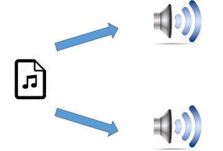
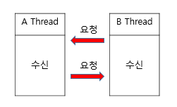
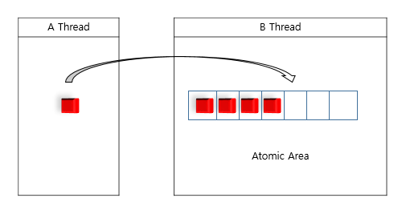
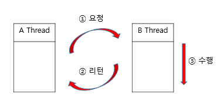
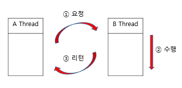
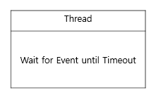
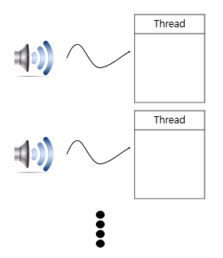
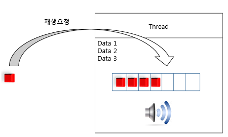
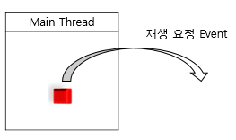
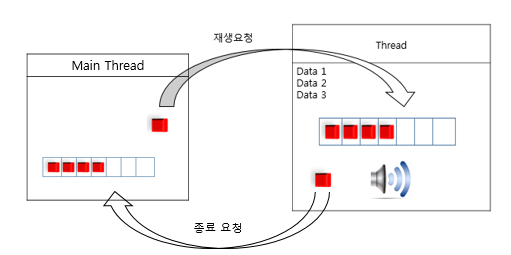

## #1 Thread
Process를 설계하다보면, 실시간처리, Blocking I/O처리,  단일Context등의 관리를 위해 
Thread를 사용한 병렬처리를 요구하는 경우가 발생한다. 

>  Thread가 요구되는 간단한 예

프로그램이 구동되면 하나의 오디오 파일에서 2개의 출력 장치로 
Sound를 출력하는 아래의 예시 코드를 보자
  

    void main()
    {
     open_file();      
     while(!end_file())
     {
      unsigned char *data = read_file();
      write_audio1(data);
      write_audio2(data);
     }
    }


진입점에서 오디오파일을 열고 파일의 데이터를 전부 읽을때까지 while루프 안에서 
1번, 2번 audio 출력장치로 data를 내보내는 코드이다.

### 여기서 발생할수 있는 문제점은 무엇일까?

문제 발생지점은 write_audio1(data);, write_audio2(data); 부분이다. 
항상 1번 출력을 완료한후 2번을 출력하고, 다시 2번 출력을 완료한후 1번출력을 수행하기 때문에
개별 출력 관점에서 볼때 음단절이 발생할 확률이 크다.
예시에서는 단2개의 출력이지만 n개의, 즉 출력 장치가 많아 질수록 위 문제점은 더 부각될것이다.

### 해결 방법은?

write_audio 수행을 병렬로 처리하는것이다. 
각자의 출력장치가 다른 출력장치의 결과가 반환되기를 기다린후 동작하는 것이 아닌 
각자의 Thread에서 개별적으로 출력하는것이다.

> *(Thead로  분리한다해도 단일 코어등 Spec이 낮은 하드웨어에선 동일한 결과가 발생할것이라 생각될수 있지만,
> Cpu는 데이터를 Bus를 통해 장치로 내보내는 I/O작업 과정에서 또는 기타I/O등에서 Context Switching을 발생시키기 때문에 
> 단일 Thread에서 작업되는 내용보다 더욱 효율적이다.)*

 '각자의 Thread에서 개별적으로 출력하는것'은 여러 구조설계방안과 단순 Thread처리가 가능하지만 
여기서는 #2의 Workqueue를 기반한 구조설계방안으로 접근할것이다. 
먼저 #2 정의를 살펴보고 #3에서 실제 적용예시를 살펴보자

## #2 Workqueue

Workqueue는 Event 송/수신을 통해 기존의 Function Call에 기반한 프로그래밍이 아닌
Event 기반의 Thread프로그래밍을 가능하게한다. 
생성한 Thread를 Event를 요청하는 '요청자'와 수신된 Event를 처리하는 '수신자'로 분리하며,
  

(요청자임과 동시에 수신자가 될수있으며, 반대의 경우도 동일하다)

   
	 
Naming에서도 알 수 있듯이 Queue에 기반하여 Event를 송/수신하고,  때문에 별도의 CriticalSection구역을 
지정 하지 않아도 원자적인 Data 처리가 가능하다.
                          

                          
요청자는 Blocking Mode 또는 None Blocking Mode로 수신자에게 Event 전달 할 수 있기 때문에
단순 Event전달 요청으로 수행을 완료할수도 필요에 따라 수신 Thread의 Event수행결과를 반환받고 
수행을 완료할 수도있다. 
 

(None Block Mode)

 

(Block Mode)

   
	 
수신자는 자신의 EventQueue를 감시하며 외부 요청에의한 Event Trigger시 해당 요청을 수행한다. 
EventQueue를 감시함에 있어서 Cpu자원을 소비하지 않기 때문에 다른 Thread의 동작에 영향을 주지 않고
Sleep하는것이 가능하고 Timeout을 설정할수 있기때문에 자신만의 Scheduling을 가져갈수있다. 
 
 
 
> 간단히 요약하면 Thread간의 Communication 도구 이다.

## #3 Apply to
이제 #1의 개선방안을 #2를 기반으로 구조설계를 변경해 보자.
먼저의생각해볼점은
 
1.  Thread 구성?
2.  Thread Stack 생성된 출력장치의 Meta data관리?
3.  파일Instance를 2개의 Thread에서 접근한다?
4.  Thread BusyLock?
5. 출력장치와의 Interface?

### Workqueue를 기반하면 위의 생각해볼 사항들을 다음과 같이 정리할 수 있다.

> Thread 구성?

#2에서 Workqueue는 생성된 Thread를 Event 수신자로서 동작하는것이 가능하다고 하였다. 
이는 자신이 파일에서 직접 Data를 읽지 않고 외부로 부터 Event로 Data를 수신할 수 있다는 말이된다. 
그렇기에 각 출력장치에 대응하는 1:1의 Thread를 생성한다.
 

>  Thread Stack 생성된 출력장치의 Meta data관리?

우리가 프로그래밍을 하다보면 이론적으로 '캡슐화'라는 용어를 접하게 된다. 
"'캡슐화'는 필요한 속성 또는 행위를 하나로 묶고 외부에서 사용하지 못하도록 은닉한다. "
로 의미를 해석할 수 있다. 
캡슐화를 하지 않고 전역적으로 사용되는 속성들이 늘어나면 Module의 개념을 잃어버리게 되고,
 필요한 동작과 전혀 관계없는 코드에서도 모두 참조가 가능하므로, 뒤죽박죽 섞인, 나아가선 전혀 관리 할 수 없는 코드가 될것이다.
 또한 System의 Static한 Resource들은 자신만의 속성( Meta data)을 가지고 있기 때문에 여러 Thread또는 전역적으로 참조가 가능해지면,
 System에 예기치 못한 상황을 발생 시킬수 있다. 
 
 그럼 이제 위의 캡슐화 내용을 충족시키기 위한 방법으로 Thread의 Stack에 Meta Data를 생성하자. 
 Thread Stack에 생성된 Meta Data는 강제로  Pointer로 엮지 않는이상 외부로 노출될 수 없고, 해당 Thread 내에서 모든 처리가 가능해지기 때문에 
 Module의 의미를 가질 수 있다. 
 
 "그럼 다른 곳에서 Meta Data가 필요해 지면 어떻게 할 것인가?" 이와 같은 질문이 생길수 있다. 
 Meta Data는 그 Resource에 대한 동작을 수행하기위한 내용들이기 때문에 수행해줄 어떠한 Module만 있다면 
 내가 그 Meta Data를 직접 참조하지 않아도 되며, 단지 요청만 하면되는 것이다.
 
 
 
> 파일Instance를 2개의 Thread에서 접근한다?

file 또한 System에 존재하는 유일한 Resource로 볼 수 있다. 
위에서 이미 유일한 Resource에 대한 접근 방법을 설명하였다. 
그렇다면 파일에 대한 Module(Thread) 를 생성해야 하는 것인가?
물론 별도로 만들어도 큰 문제는 발생하지 않는다. 
다만 우리에겐 이미 main thread가 생성되어 있으므로 재생 요청자를 main thread로 설정하자

> Thread BusyLock?

#2에서 "수신자는 EventQueue를 감시함에 있어서 Cpu자원을 소비하지 않는다."
처럼 Workqueue는 다른 Thread의 동작에 영향을 주지 않는다.

> 출력장치와의 Interface?

지금까진 MainThread에서 출력 Thread로 재생을요청하는 Interface만 존재한다. 
출력장치라는건 Output에 대한 Spec이 변경될 수도 있고 때론 System의 문제로 출력을 할 수 없는 상황 이 발생할 수 있다. 
한 예로  더이상 출력하지 못한 상황이 발생한다면, 더이상 MainThread로 부터 재생을 요청하는 Event를 수신 하지 않아도 될것이다. 
그렇다면 어떻게 Event를 수신 하지 않도록 변경할 수 있을까?

#2에서 Workqueue는 요청자임과 동시에 수신자가 될 수 있음을 설명하였다. 
지금까지 수신자 역할만 해오던 출력장치Thread에 요청자 기능을 추가하고 요청기능만 수행하던 MainThread에 수신기능을 추가하면
위 내용을 모두 만족한다.

### 이제 위의 구조설계를 코드로 표현해보자

Main.cpp


    void main()
    {
      /*MainThread's Meta data 생성*/		
     /*출력할 오디오 파일 Open */		
     open_file();                                            
     /*출력 Thread 생성*/		 
     output_thread_audio1_start();
     output_thread_audio2_start();
		 
    /*Main Loop*/
     while(1)
     {
      int timeout = 0;
      /*Event 수신대기(여기서 "timeout"을 0으로 설정하였기 때문에 Event 발생까지
           Block되지 않고 Event수신 여부만 확인하고 바로 Return)*/
      int result = workqueue_recv(timeout);
      if(result == timeout_occur)
      {
       /*수신된 Event가 없는경우 Data를 얻어옴*/			
       data=read_file();
      /*읽어온 Data를 출력Thread로 전송*/
       workqueue_send(data);
       workqueue_send(data);
      }
      if(result == has_event)
      {
       /*수신된 Event가 존재하는경우 MainLoop종료*/
       output_thread_audio1_stop();
       output_thread_audio2_stop();
       break;
      }
     }
    }


위 코드에서 핵심은 "workqueue_recv(timeout)"와 "workqueue_send(data)"이다. 
"workqueue_recv(timeout)"를 통해 수신자 역할을 하고, "workqueue_send(data)"를 통해 요청자 역할을 동시에 사용함으로써
생성한 출력 Thread와 Communication을 수행하고있음을 볼 수 있다. 
Event 수신 대기시("workqueue_recv(timeout)")에 Timeout을 지정하지 않음으로써 Block되지 않고 단순 Event발생 여부만 확인하며,
특별히 처리할 Event가 없는경우 자신의 본 역할, 파일에서 Data를 읽어 "workqueue_send(data)"를 통해 출력 Thread로 Event를 요청하고
발생한 Event가 있는경우 그 요청에 대한 내용을 수행하는 모습을 볼 수 있다.

Output_Thread_Audio.cpp


    void thread_start_routine()
    {
    /*Metadata 생성*/		
     open_audio(device);     
     while(1)		 
    {
       int timeout = infinite;
      /*Event 수신대기(Timeout을 infinite로 설정하였기때문에,
          MainThread의 Event요청이 있을시까지 무한대기)*/
      int result = workqueue_recv(timeout);
      if(result == has_event)
      {
        /*Event 수신시 오디오 장치로 Data 쓰기*/			
        int res = write_audio(data);			
        /*오디오 장치의 결과를 확인하고 오류 발생시, 종료요청*/
       if(!res)workqueue_send(close);
      }						
     }     
    }

Main Thread의 코드 흐름과 크게 차이점이 없다.
여기서도 "workqueue_recv(timeout)", "workqueue_send(data)"를 통해 요청/수신역할을 모두 수행하며,
단지 Event발생시 자신의 역할인오디오장치로 Data를 내보내며, 내보낸 결과가 오류를 반환하면 Main으로 종료를 요청하게된다.

## #4 As I Finished...
지금까지 #1에서 Thread의 필요성 #2에서 Workqueue 이론 #3에선 #1과 #2를 조합한 구조설계 방향을 알아보았다. 

내가 이 Workqueue라는 기능을 만들어 사용하고 있는 이유는,  개발하면서 항상 생각하게되는 Module 코드 작성, 

Thread 비용감소 측면과 프로그램의 기반을 두기 위함이다.

어떤 Project를 진행할때, 단순 Output만이 아닌 그 프로그램의 명확한 구조설계, 이를 바탕으로한  Framework를 가져가는것이

코드작성의 목적이 확실해지고, 동작 오류를 최소화하며 나아가 완료된 Project의 유지보수에 소요되는 시간을 줄여나갈수있다.

물론 Workqueue라는 것이 Framework라는 큰 범주를 뜻하는 것은 아니다.

다만 살을 덧붙여 Pooling, Observer등 큰 패턴을 그려낼수 있고, 구조설계에 있어 여러 시각으로 바라 볼 수 있게하는 기회를 제공해 주기에

활용성이 충분한 기능이라 생각한다.

#### 자, 그럼 이제 위 내용들을 실제 코드로 적용할수 있는 Library를 보러가자.

[workqueue_api](https://whois-hm.github.io/workqueue-api)
