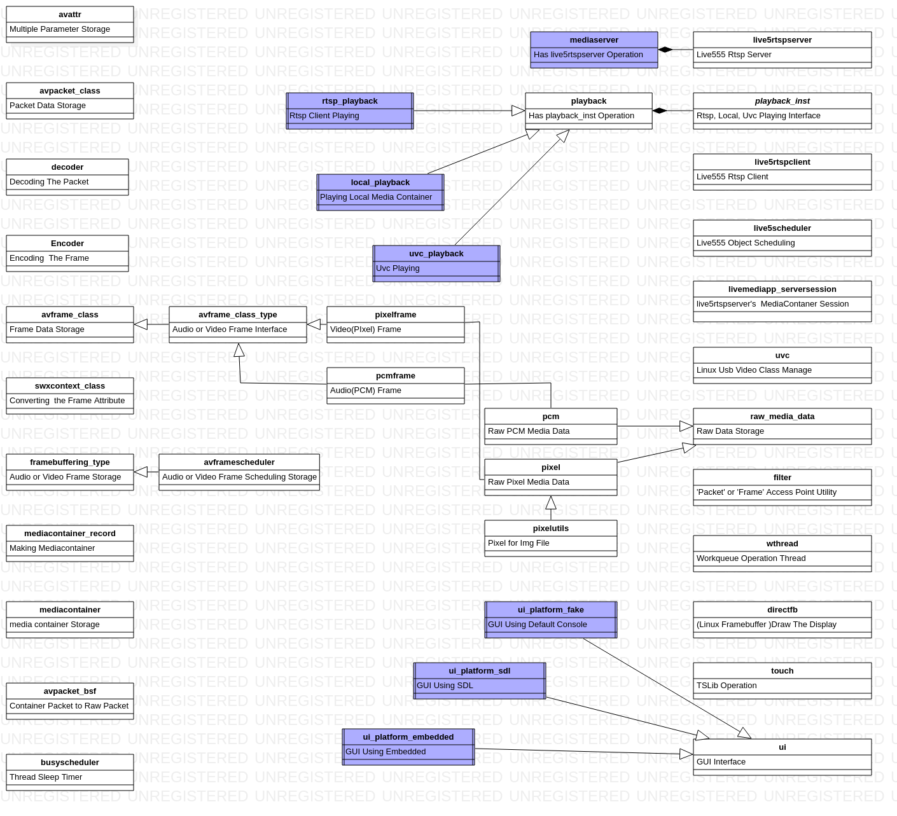
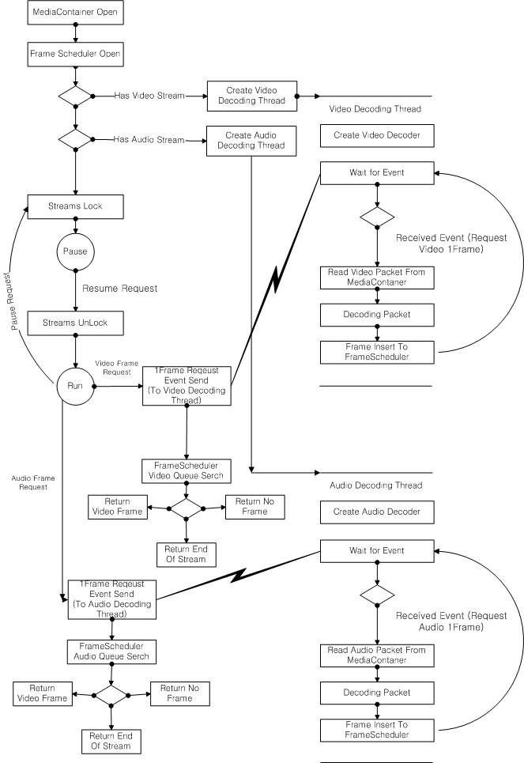
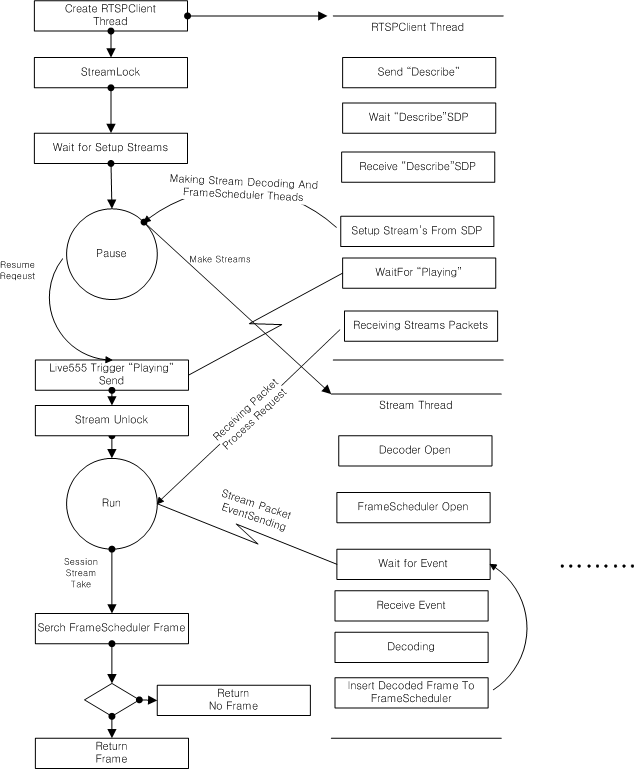
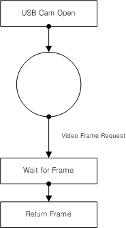
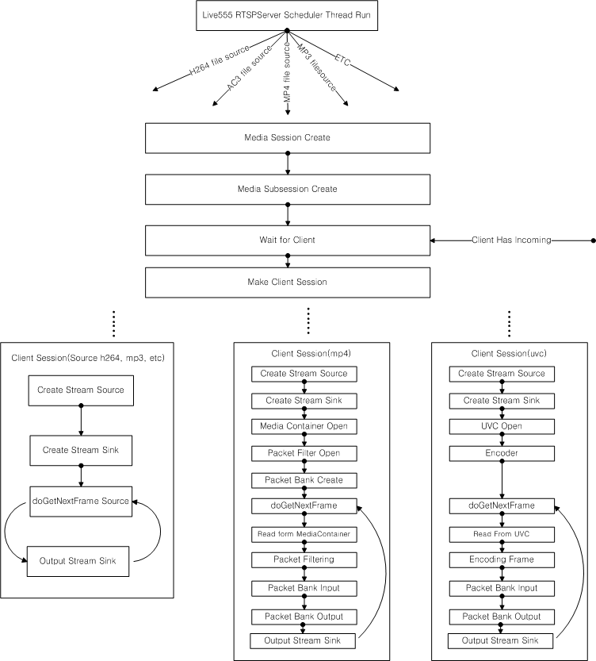

## #1Intro
이 Repository는 "Media Player"를 구현하기위한 개인 Study Project이다. 
목적은 단순 "Media Player"이지만 이를 시작하게 된 계기는 정말 다양하다. 

c/c++ STL, MultiThread기반 설계, [Workqueue 내용 증명,](http://whois-hm.github.io/about-workqueue/) 
SystemResource처리, Class Design, 주 업무 이해도를 높이기 위한
Audio/Video IO, Muxing / DeMuxing등 을 학습하며,  개인 Skill up과 동시에  산출물을 얻기 위함이다. 

주 언어는 c/c++ STL에 기반하여 설계하였고, 그렇기때문에 별도의 Library가아닌 Process에서 직접 기능단위별
Access가 가능하도록 Header에 내용을 담았다.

Project의 목적이 "Media"이므로  
Codec,  En/Decoder, Muxer/DeMuxer등은  [FFMPEG](https://www.ffmpeg.org/) 
NetWork Streaming(RTSP)는 [Live555](http://www.live555.com/) 
GUI Display는 Desktop [SDL2](https://www.libsdl.org/), Embedded [Beaglebone Black](https://github.com/whois-hm/am335x) 
을 사용하였다.

## #2Class Simple Diagram

## #3 Main Activity Class Sequence Diagram
#### 
local_playback

####  
MediaContainer (mp4, avi)등 동영상 파일을 재생

####  
rtsp_playback

####  
RTSP Server수신 Client로 Streaming Data를 재생

####  
uvc_playback

USB Cam Device Input Data를 재생

####  

####  
mediaserver

####  
RTSPServer로 기본 동영상파일, USB Cam Device, Proxy를 Stream

## #4 As I Finished...
OpenSource에서 제공되는 API들을 단위 기능 Class로 분리하고, 이를 조합하여 

현재까진 Local MediaFile, RTSP Client, Camera Player와 RTSP Server의 기본기능이  Porting되어 있고,

이에 대한 Output Frameork가 Porting되어 있다. 

앞으로도 개인 시간을 쪼개 더 많은 기능을 학습, Porting할 예정이다. 

[livemedia](https://github.com/whois-hm/livemedia)
