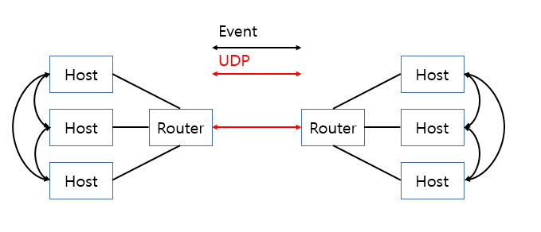

## #1Intro
프로젝트를 진행할때 가장 중요한것은 "구조설계"이다.
Framework는 이 구조설계의 기반이 되며, 작성될 코드의 방향을 제시한다. 
여러 Opensource에서 Framework를 제공하기 때문에 우리는 진행할 프로젝트의 컨셉에 맞는 
Framework를 선정하거나 선정된 Framework를 Customize하여 사용하기도 하고, 때론 직접 제작하여 
사용하기도 한다. 
이번 Post에서는 "NetGroup"이라는 직접 만들어본 Event Report Framework를 소개해 보고자 한다.

## #2 What's NetGroup
"NetGroup"이란 무엇인가?
간단히 말하자면 Thread, Process간의 Communication Group이며 여기에 Network 개념을 도입하여,
Unicast, BroadCast, Multicast 방식으로 Event를 송/수신하여 원하는 동작을 수행시킬수 있도록 하는 Framework이다.

이 Framework는 각 기능단위별 모듈을 "Host"라 칭하는 Thread로 생성하며, 이러한 "Host"들은 Router라는 한개의 단위에 등록되어 Thread간 Event 송수신이 가능한 Network Group을 이룰수 있도록하고,
Router간 통신은 UDP를 기반하여 Protocol을 통한 Process간 Event송수신을 가능하게 한다.

그렇기때문에 설계방향에 따라 하나의 Process내에서 목적에 따른 Grouping을 할 수 있고, 때론 Process단위로 Grouping하는 것이 가능하다. 

## #3 More Detail
<U><I>-송/수신기능</I></U>
1. Unicast : 각 "Host"의 1:1로 송신하는 방식
2. Broadcast : Router에 등록된 모든 "Host"에 송신하는 방식
3. Multicast : Router의 RoutingTable에 등록된 "Host"에만 송신하는 방식

<U><I>-Timer기능</I></U>

각 "Host"는 자신의 Scheduling에 원하는 Timer를 생성하여 특정 시간이후 만료 Signal을 수신할 수 있으며, 
단일 모드와 Repeat모드를 설정할 수 있다.

<U><I>-En/Decoder기능</I></U>

각 Router간 송/수신은 String을 기반하기 때문에 원하는 Format(XML, JSON등)을 사용 할 수 있으며, 
Encoder Input, Decoder Output은 Structure등 Data기반으로 운영할 수 있다. 
## #4Why use this?
프로젝트를 진행하다보면 협업,  구상설계, 모듈화, 종속성, 추상화등 많은 조건들을 만족해야 이후에 확장성있는, 안정성있는, 유지보수가 적은 완성도높은 완료된 프로젝트가 될 수 있다. 

이 Framework의 가장큰 목적은 서로 Event를 기반한 Interface로 연결되어있기 때문에 보다 적은 느슨한 결합을 이뤄 낼 수 있도록하고  기능별 Thread를 제공하기 때문에  Plug-in 형태로 기능을 때에 맞춰 확장, 변경하는것이 유용함과 동시에 별도로 모듈화를 하지 않아도 큰 틀에서 이미 모듈화가 이루어지도록 하는 것이다.
## #4As I Finished...
이번Post는 Framework를 소개하였다. 
Framework라는 거창한 용어를 사용했지만, 사실 내가 코드를 작성하면서 매번 반복작업하던것, 필요하다 느낀것들을 모아 컨셉을 잡고 만든것이기도하고, Event를 기반한 Code를 자주 사용하는데,  C/C++ Open Library에서 이기능에만 충실한 Library를 찾지 못해 만든것이기도하다.
