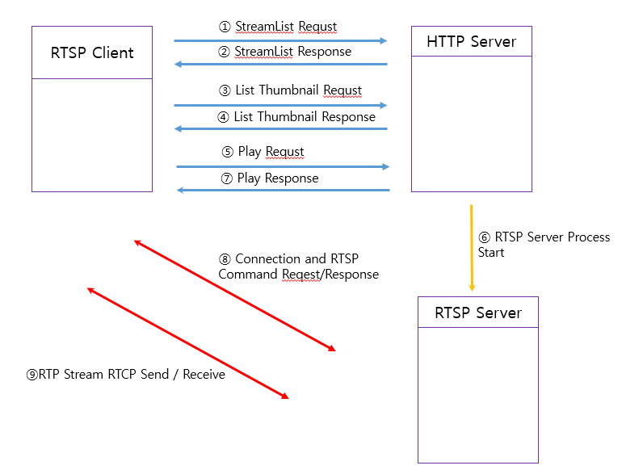

## #1 Intro
RTSP 스트리밍 서비스 플래폼 구성

Repository : [liveplatform](https://github.com/whois-hm/live_platform)
## #2 Environment
* Test 환경         :  Linux OS 32bit / Linux OS 64bit / Linux OS armv7l Embedded
* Core Media Source Repository : [livemedia](https://github.com/whois-hm/livemedia)
* Core Media Source  Description :  [livemedia description](http://whois-hm.github.io/aboute-livemedia/) 
* Core Workqueue Source Repository :  [workqueue](https://github.com/whois-hm/workqueue)
* Core Workqueue Source Description : [workqueue description](http://whois-hm.github.io/about-workqueue/) 
* Gui (Qt)
* HTTP / JSON(POCO)
* 동영상 화면 녹화 (vlc)
                            
## #3 Platform Design

## #4 Service Video

<html>
	<head>
		</head>
	<body>
<video src="../images/liveplatform_sample.mp4"   type="video/mp4"  type="video/ogg" width="400" height="400"   controls></video>
		</body>
	</html>
